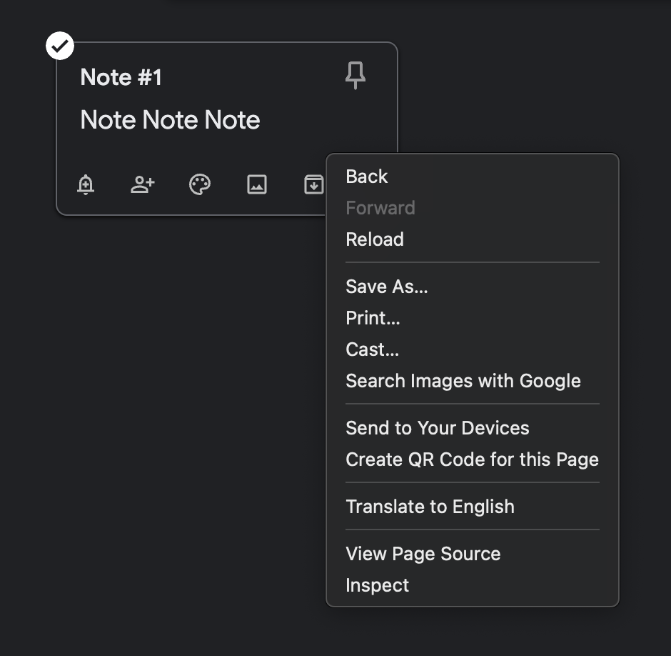
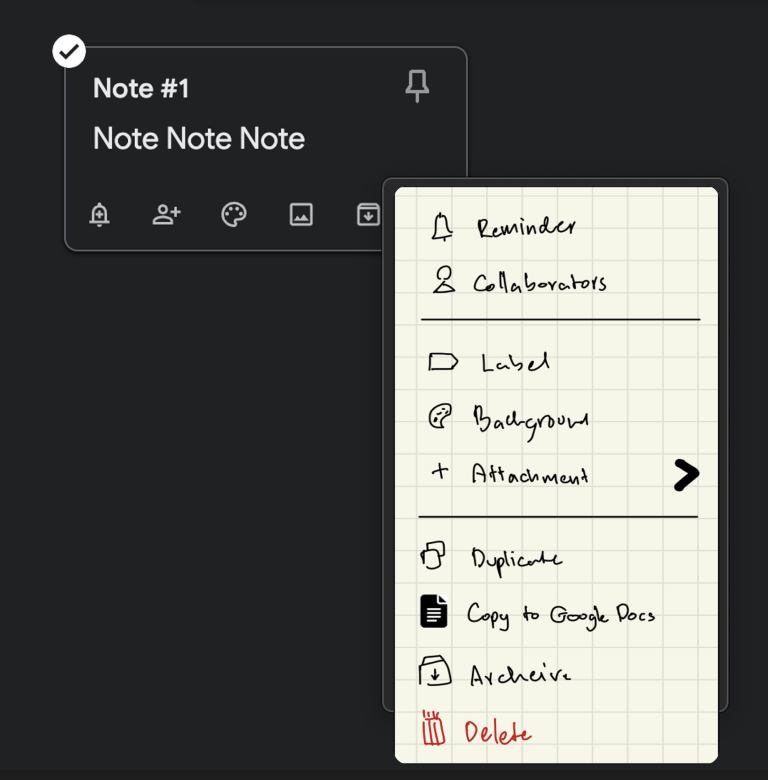
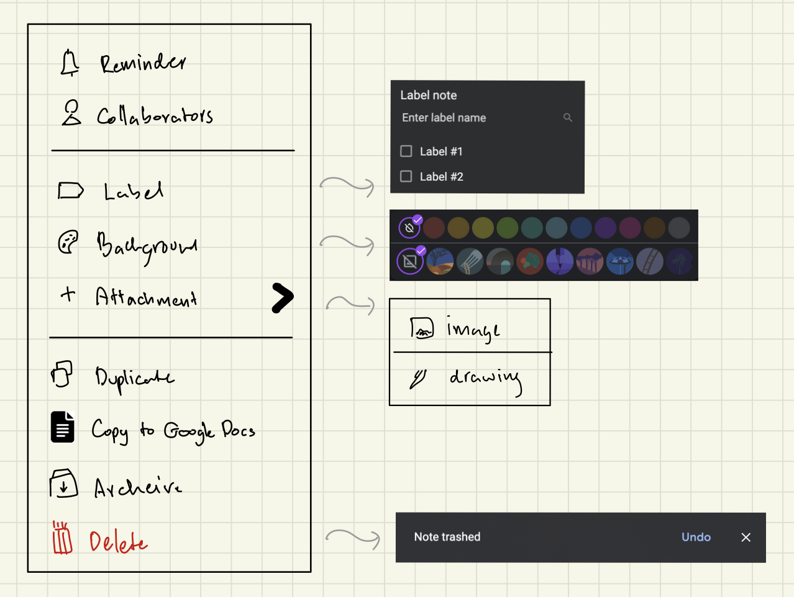

# The Problem

Google Keep is a simple note-taking app developed by Google that syncs quickly and efficiently across iOS, Android, and web platforms. 

Despite that one thing that bugs me is the absence of a custom right-click menu on the web app, which is valuable for dealing with lots of notes. Without it, I have to move the mouse a lot more, and it slows everything down.

 

  
   
  <em>By default, Keep do not have custom right-click menu.</em>

 

# The Solution

We can improve the user experience for Keep's heavy users by adding a custom right-click menu using a Chrome extension. This will make dealing with lots of notes much quicker.

 

  
   
  <em>Keep with custom right-click menu.</em>

 

  
   
  <em>Wireframe</em>

 

# Technical Specs

It should be a chrome extension that add custom context menu to 'keep.google.com'. 

Just a quick thought, it would be possible make clicking the custom button click the button on the DOM. 

  
Keep API

  Google just dropped new [Keep API](https://developers.google.com/keep/api/reference/rest). Worth checking it out, it can now do CRUD. I'm not quite sure that non-enterprise can now use the API or not, before it is only avaliable for enterprise.

